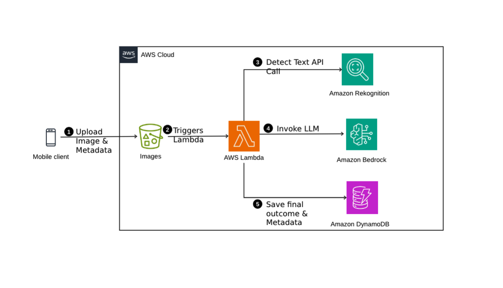
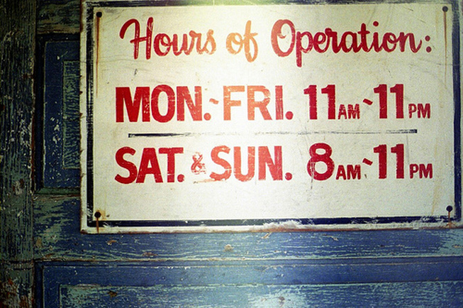

# AWS Serverless Multi-Modal Image Text Validation
Repository hosting sample AWS CDK code for the AWS Serverless Multi-Modal Image Text Validation sample code. 

This sample code demonstrates an approach to image recognition and explanation using AWS Rekognition, AWS Lambda, and Amazon Bedrock.

In the example use case, we process storefront hours signs to determine if the store is open or closed, given the current timestamp. We use Amazon Rekognition to detect text in the image, and then use Amazon Bedrock to explain the results of the text detection. 

We use single shot prompting technique to enable complex reasoning capabilities of the large language model (LLM).

The diagram below shows the overall architecture. Once images are dropped into an S3 bucket, an event triggers a Lambda function (rek-bedrock.py). The function then orchestrates the calls to AWS Rekognition, Amazon Bedrock and then finally stores the outcome in an Amazon DynamoDB table.

## Example

### Input:
Current timestamp: Tuesday 01/23/2024 19:02:00

Image with hours of operation:

### Output:
Outcome: Not Closed

Reason: The current day is Tuesday and the current time is 19:02. Since the restaurant is open Monday-Friday 11AM-11PM and Saturday-Sunday 8AM-11PM, the restaurant is not closed at the current day and time.   

## Instructions to Use/Deploy this solution 

### Pre-requisites
1. Install [NPM](https://docs.npmjs.com/downloading-and-installing-node-js-and-npm)
2. Install [CDK](https://docs.aws.amazon.com/cdk/v2/guide/getting_started.html)

### Steps to deploy
1. Clone this repository
2. `cd` into the `cdk` directory
3. Run `sudo npm install --legacy-peer-deps` to install dependencies
4. If necessary  run `cdk bootstrap` to bootstrap your environment
5. Run `cdk deploy` to deploy the stack

### Running the Solution

1. Choose any image from the `images` folder under `bedrock-rekognition-sample`
2. Drop the image in the S3 bucket named `multi-modal-landing-bucket`
3. An event is generated that triggers the Lambda function 
4. The Lambda function processes the image text and stores the final outcome in 
   DynamoDB table called `restaurant-results-table`

### Cleanup

## Authors

This solution was co-developed by Swagat Kulkarni and Tony Howell.

